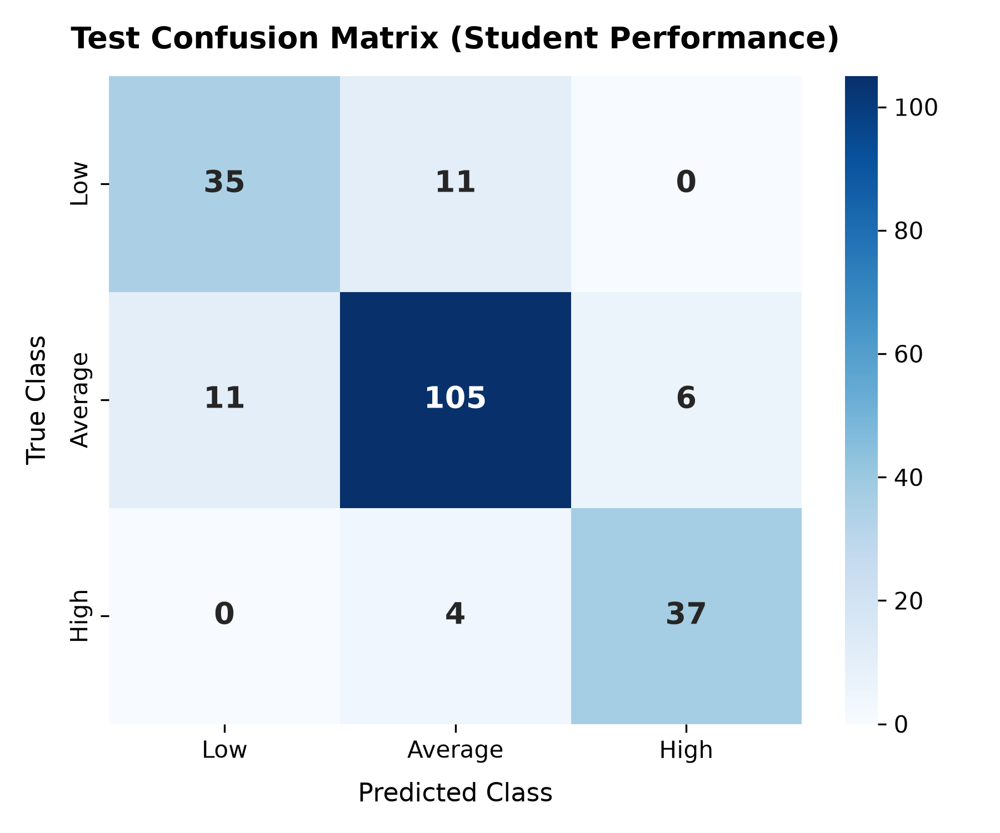

# EduPredict: Student Academic Performance & Risk Classifier

An end-to-end Machine Learning system that classifies student academic performance into **High**, **Average**, or **Low** tiers, provides Explainable AI (XAI) feature attribution, flags at-risk students, and delivers prescriptive improvement suggestions through an interactive interface.

---

## 🌟 Key Features

- **Multi-Class Classification**: Categorizes performance into `High` (Grades 15–20), `Average` (Grades 10–14), and `Low` (Grades 0–9) with confidence scoring.
- **Explainable AI (Factor Attribution)**: Calculates exact positive drivers and negative drags for individual predictions via marginal feature perturbation.
- **Academic Risk Early Warning (Bonus)**: Identifies at-risk students (High, Moderate, Low Risk) based on failure history, chronic absenteeism, and study deficits.
- **Prescriptive Action Plans (Bonus)**: Generates prioritized, personalized recommendations tailored to individual student weaknesses.
- **Batch CSV Analysis (Bonus)**: Enables multi-student CSV upload, batch diagnostic evaluation, and enriched CSV report export.
- **Interactive Web App (Bonus)**: Clean Streamlit application for both single-student inference and batch cohort exploration.

---

## 🛠️ Technology Stack

- **Language**: Python 3.10+
- **Data & Core ML**: `Pandas`, `NumPy`, `scikit-learn`
- **Visualization**: `Matplotlib`, `Seaborn`
- **Web Interface**: `Streamlit`
- **Persistence**: `Joblib`

---

## 🚀 Setup & Installation

### 1. Clone & Navigate
```bash
git clone https://github.com/20anuragsingh/GDG_ABESEC.git
cd GDG_ABESEC
```

### 2. Create Virtual Environment & Install Dependencies
```bash
python3 -m venv venv
source venv/bin/activate
pip install -r requirements.txt
```

### 3. Launch Interactive Web App
```bash
streamlit run app.py
```

### 4. CLI Execution
- **Train & Benchmark Models**:
  ```bash
  python src/train.py
  ```
- **Single Demo Prediction**:
  ```bash
  python src/predict.py
  ```
- **Batch CSV Prediction**:
  ```bash
  python src/predict.py --input_csv data/sample_students.csv --output_csv predictions.csv
  ```
- **Run Test Suite**:
  ```bash
  python -m unittest tests/test_pipeline.py
  ```

---

## 📂 Dataset & Source

- **Dataset**: [UCI Student Performance Dataset](https://archive.ics.uci.edu/dataset/320/student+performance) (Cortez & Silva, 2008, University of Minho).
- **Scope**: 1,044 student records across Mathematics and Portuguese subjects with 32 demographic, social, attendance, and academic attributes.
- **Target Discretization**: Standard Portuguese 20-point scale:
  - **High**: $15 \le G3 \le 20$ ($\ge 75\%$)
  - **Average**: $10 \le G3 \le 14$ ($50\% - 70\%$)
  - **Low**: $0 \le G3 \le 9$ ($< 50\%$, Failing/At-Risk)

---

## 🧠 Machine Learning Approach

### 1. Preprocessing Pipeline
- **Numerical Features** (`G1`, `G2`, `studytime`, `absences`, `failures`, etc.): Standardized via `StandardScaler`.
- **Categorical Features** (`school`, `Mjob`, `higher`, `internet`, etc.): Encoded via `OneHotEncoder(drop='first', handle_unknown='ignore')`.
- Encapsulated into a leak-free `ColumnTransformer` inside a unified scikit-learn `Pipeline`.

### 2. Model Selection & Cross-Validation Benchmarks (5-Fold CV)
| Model | CV Accuracy | Weighted F1 | Macro F1 |
| :--- | :---: | :---: | :---: |
| **Random Forest (Selected)** | **86.11% (±0.0108)** | **0.8620** | **0.8557** |
| Gradient Boosting | 85.25% (±0.0138) | 0.8516 | 0.8393 |
| Logistic Regression | 83.72% (±0.0066) | 0.8388 | 0.8325 |
| Support Vector Machine (SVC) | 82.00% (±0.0286) | 0.8216 | 0.8144 |

### 3. Holdout Test Set Performance (80/20 Stratified Split)
- **Overall Accuracy**: **84.69%**
- **Weighted F1**: **0.8468** | **Macro F1**: **0.8365**
- **Class-wise Metrics**:
  - `High`: Precision = 0.86, Recall = 0.90, F1 = 0.88
  - `Average`: Precision = 0.88, Recall = 0.86, F1 = 0.87
  - `Low`: Precision = 0.76, Recall = 0.76, F1 = 0.76



---

## 💡 Challenges Faced & Solutions

1. **Class Imbalance**:
   - *Challenge*: The dataset naturally has more Average students (58.4%) than High (19.5%) or Low (22.0%).
   - *Solution*: Configured `class_weight='balanced'` in Random Forest and evaluated Macro F1 alongside accuracy to ensure minority classes are predicted accurately without bias.
2. **Feature Leakage Prevention**:
   - *Challenge*: Preprocessing statistics (mean/std/one-hot levels) must not leak from test/evaluation data.
   - *Solution*: Coupled preprocessing and estimator inside a single `Pipeline`, ensuring transformation parameters fit strictly on training folds during cross-validation.
3. **Local Explainability without Bloated Dependencies**:
   - *Challenge*: Heavy external explainability libraries can create version conflicts and slow inference.
   - *Solution*: Implemented marginal perturbation attribution against population baselines, yielding fast, mathematically intuitive directional impact scores ($\Delta P$).

---

## 📁 Repository Structure

```
GDG_ABESEC/
├── app.py                      # Interactive Streamlit Web Application
├── requirements.txt            # Project dependencies
├── .gitignore                  # Git ignore specification
├── README.md                   # Project documentation
├── data/
│   ├── student-mat.csv         # Math course dataset
│   ├── student-por.csv         # Portuguese course dataset
│   └── sample_students.csv     # Ready-to-use batch testing template
├── models/
│   ├── best_model.joblib       # Serialized production pipeline
│   ├── model_metadata.json     # Test metrics & feature rankings
│   └── confusion_matrix.png    # Test set confusion matrix figure
├── src/
│   ├── __init__.py
│   ├── data_loader.py          # Data ingestion, schema & target discretization
│   ├── train.py                # Benchmarking, CV & model persistence
│   ├── predict.py              # Single & batch inference engine
│   └── explainer.py            # Local feature attribution & risk rules
└── tests/
    ├── __init__.py
    └── test_pipeline.py        # Automated test suite (7/7 passing)
```

---

## 🌐 Deployed Project Link

- **Local Web App**: Run `streamlit run app.py` (Local URL: `http://localhost:8501`)
- **Live Deployment**: Deployable with zero code change on [Streamlit Community Cloud](https://share.streamlit.io/) or Render/HuggingFace Spaces by pointing directly to this repository and `app.py`.
